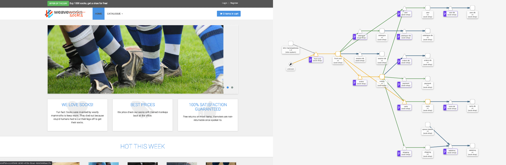
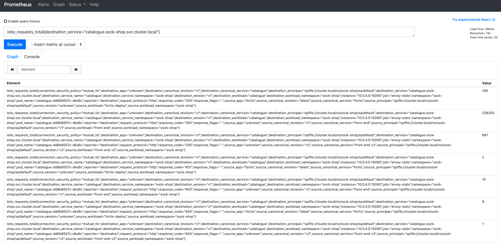
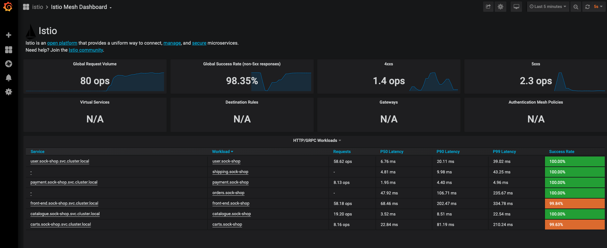
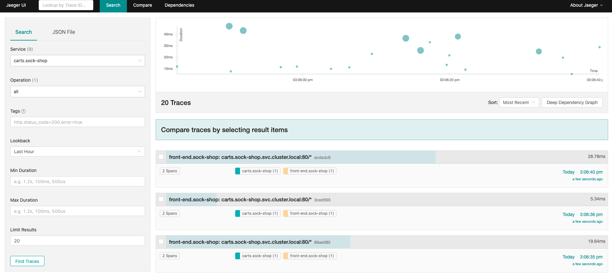
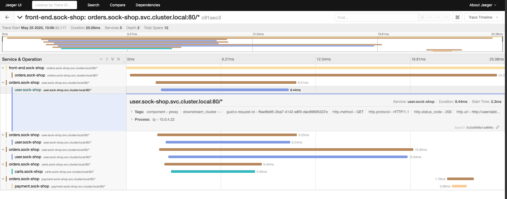
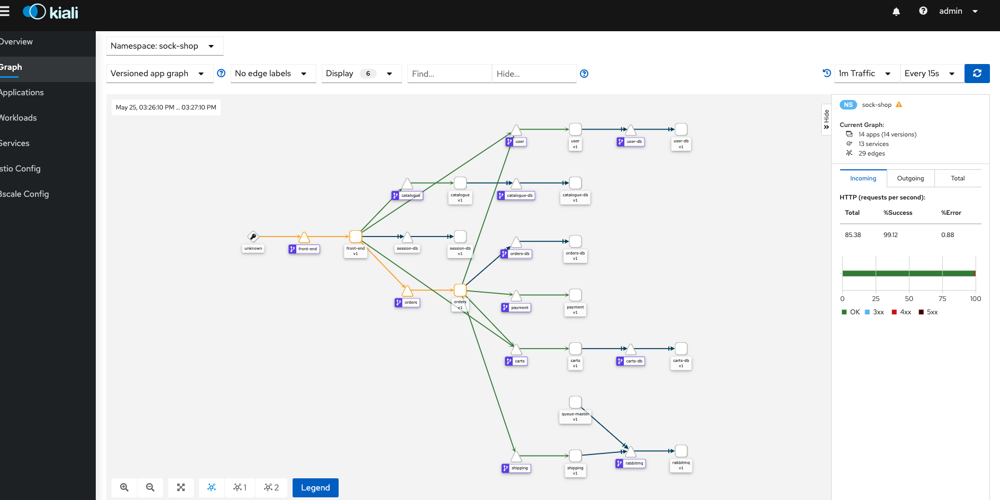
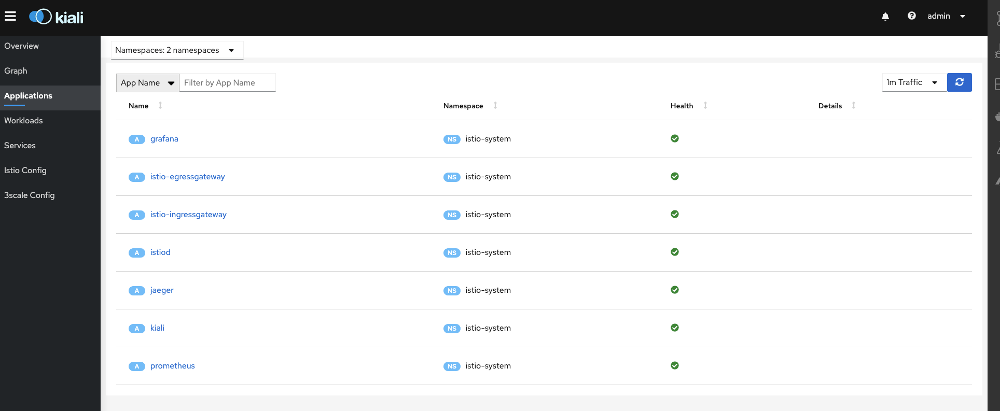

# Service Mesh Workshop with Istio on Google Cloud Platform
This repo contains the code samples and step by step instructions for the Service Mesh Workshop with Istio on Google Cloud Platform (GCP) delivered during the following events:

- [Devoxx Poland 2022](https://devoxx.pl/talk-details/?id=2840)

The code in this repo have been forked from [Mohamed Aboullaite](https://github.com/aboullaite/aboullaite) [service-mesh](https://github.com/aboullaite/service-mesh) repo and adapted to work on [Google Kubernetes Engine](https://cloud.google.com/kubernetes-engine/) on GCP with Istio.

This demo is deployed and tested with `kubernetes 1.22` and `istio 1.14.1`



# Content
- [0. Prepare the environment & Install istio](#0-prepare-the-environment-and-install-istio)
- [1. App Deployment](#1-app-deployment)
    - [0. Prepare your namespace](#0-prepare-your-namespace)
    - [1. Deploy the app](#1-deploy-the-app)
    - [2. Configure Istio Virtualservices & Destinationrules](#2-configure-istio-virtualservices--destinationrules)
    - [3. Configure the Istio Ingress Gateway](#3-configure-the-istio-ingress-gateway)
    - [4. Verifying the config](#4-verifying-the-config)
    - [5. User accounts](#5-user-accounts)
- [2. Traffic Management](#2-traffic-management)
    - [1. Blue/Green Deployment](#1-bluegreen-deployment)
    - [2. Canary deployment](#2-canary-deployment)
    - [3. Route based on some criteria](#3-route-based-on-some-criteria)
    - [4. Mirroring](#4-mirroring)
- [3. Resiliency](#3-resiliency)
    - [1. Fault injection](#1-fault-injection)
    - [2. Circuit Breaking](#2-circuit-breaking)
    - [3. Retries](#3-retries)
    - [4. Timeouts](#4-timeouts)
- [4. Policy](#4-policy)
    - [1. Rate limiting](#1-rate-limiting)
    - [2. CORS](#2-cors)
- [5. Security](#5-Security)
    - [1. Mutual TLS authentication](#1-mutual-tls-authentication)
    - [2. Authorization for HTTP traffic](#2-authorization-for-http-traffic)
    - [3. JWT](#3-jwt)
- [6. Observability](#6-observability)
    - [1. Prometheus](#1-prometheus)
    - [2. Grafana](#2-grafana)
    - [3. Tracing](#3-tracing)
    - [4. Kiali](#4-kiali)

## 0. Prepare the environment and Install istio
At the begining of this workshop, you should have been given credentials for a Google Cloud Platform(GCP) project to use. 

Follow the instructions below to provision a Google Kubernetes Cluster(GKE), deploy Istio and verify the environment is ready to start the workshop.

1. Login to the Google Cloud Console:
    * (Ideally) If you are using Google Chrome, use an incognito TAB and open the [GCP console](https://console.cloud.google.com/welcome?project=XXXXXXX). Replace `XXXXXXX` in the URL with the PROJECT_ID you are given.
    * If you are using a a different browser open the console with the URL above in a new TAB. 

`PS: incognito helps you keep your already logged in Google profiles clean.`

2. Use the provided credentials to login to the Google Account. This should bring you to the 
home page of the Google Cloud Console.

3. From the top right part of the page, click on the `Activate Cloud Shell Button`

.

`PS: Google Cloud is rolling out a new interface. So the screenshots in this repo might look different but the logos should look the same.`

Wait a few moments, it could take a while for the Cloud Shell to be provisioned. You will be using it for the rest of this workshop.

4. Clone this repository in the cloud shell
```bash
git clone https://github.com/boredabdel/istio-workshop-gcp.git
```

cd into the repo folder.
```bash 
cd istio-workshop-gcp
```

5. Create a GKE cluster.
```bash
export PROJECT_ID=`gcloud config get-value project` && \
export M_TYPE=n1-standard-2 && \
export ZONE=europe-west1-b && \
export CLUSTER_NAME=istio-workshop-gcp && \
gcloud services enable container.googleapis.com && \
gcloud container clusters create $CLUSTER_NAME \
--cluster-version latest \
--machine-type=$M_TYPE \
--num-nodes 4 \
--zone $ZONE \
--project $PROJECT_ID
```

`PS: When you open the Cloud Shell for the first time and after each reload and run the gcloud command, you might be prompted to authorize the API Calls. Simply Click Authorize`.

Provisionning a cluster might take a while(about 5 min), you can navigate to the Kubernetes Engine page (use the search bar to find it) to check the status of the cluster provisioning, or wait for the command to exit.

At this stage you should have a GKE cluster provisionned in your project.

Run the following command to fetch it's credentials.
```bash
gcloud container clusters get-credentials istio-workshop-gcp --zone $ZONE
```

Run `kubectl` to ensure you have access to the cluster.
```bash
kubectl get nodes
```

If you see a list of nodes you are good to go. Otherwise stop here and ask one of the workshop facilitators for help.

6. Deploy Istio. 

Istio has many [documentated](https://istio.io/latest/docs/setup/getting-started/#download) ways to be deployed. For the purposes of this workshop, we will use the most straightforward method:

Download the `istioctl` CLI.
```bash
curl -L https://istio.io/downloadIstio | sh -
```

Move to the Istio Package directory. For example if the package is `1.14.1`
```bash
cd istio-1.14.1
```

Add the istioctl client to your path (You can make these changes permanent by adding them to your ~/.bashrc or ~/.zshrc)
```bash
export PATH=$PWD/bin:$PATH
```

- Navigate back to the root of the repo and check istioctl works
```bash
cd ..
istioctl version
```

If you get a valid output (the istio version), you are good to progress.

Now we are ready to deploy Istio to the cluster. We will use the [default profile](https://istio.io/latest/docs/setup/additional-setup/config-profiles/) for this workshop
```bash
istioctl install --set profile=default -y
```

Wait for the command to finish and check istio have been deployed by checking the `istio-system` namespace(istio-system is the default namespace where the Istio control plane components are deployed).

```bash
kubectl get pods -n istio-system
```

If all pods return a `Running` status, you are good to progress.

To Recap at the end of this section you should have an UP and running GKE cluster on Google Cloud. With Istio deployed (the `istiod` control plane and the `istio-ingressgateway`).

## 1. App Deployment
At this point we are ready to deploy

### 0. Prepare your namespace
Before we deploy the app, we need to prepare the namespace where it will be deployed, and label it for automatic sidecar injection. You can read more about this [here](https://istio.io/latest/docs/setup/additional-setup/sidecar-injection/) but in a nutshell the label will trigger the Istio control plane to automatically inject the sidecars into each pod in the cluster. So you don't have to do it manually.

```bash
kubectl apply -f 1-deploy-app/manifests/sock-shop-ns.yaml 
```

### 1. Deploy the app
```bash
kubectl apply -f 1-deploy-app/manifests
```

Check everything have been deployed properly
```bash
kubectl get pods -n sock-shop
```

There should be 14 pods deployed in total. For each of them look at the `Ready` column. It should have `ready_containers/total_containers` values. That colum reports the containers in a ready stat  over the total containers supposed to be in the pod (including the sidecar). The two values should match before you move on. In other terms a `2/2` is good, while a `1/2` means things are still starting.

Wait until all containers are ready before you progress. You can track the progress of the containers by running
```bash
watch kubectl get pods -n sock-shop
```

### 2. Configure Istio Virtualservices & Destinationrules
```bash
kubectl apply -f 1-deploy-app/sockshop-virtual-services.yaml
```

[Virtualservices](https://istio.io/latest/docs/reference/config/networking/virtual-service/#VirtualService) and [Destinationrules](https://istio.io/latest/docs/reference/config/networking/destination-rule/) are key part of Istio’s traffic routing functionality. You can think of `virtualservices` as how you route your traffic to a given destination, and then you use `destinationrules` to configure what happens to traffic for that destination.

### 3. Configure the Istio Ingress Gateway
```bash
kubectl apply -f 1-deploy-app/sockshop-gateway.yaml
```
An Ingress Gateway describes a load balancer operating at the edge of the mesh that receives incoming HTTP/TCP connections. It configures exposed ports, protocols, etc. but, unlike Kubernetes Ingress Resources, It does not include any traffic routing configuration. That's where the `Gateway` Object you deployed comes into play. It describes how traffic is routed from the edge of the mesh to inside 

### 4. Verifying the config
```bash
istioctl proxy-status
```
Using the `istioctl proxy-status` command allows us to get an overview of our mesh. If you suspect one of your sidecars isn’t receiving configuration or is not synchronized, proxy-status will let you know.

You can ignore the `ECDS` column.

If everything is fine, run the below command to get the LoadBalancer IP:Port
```bash
echo $(kubectl -n istio-system get service istio-ingressgateway -o jsonpath='{.status.loadBalancer.ingress[0].ip}'):$(kubectl -n istio-system get service istio-ingressgateway -o jsonpath='{.spec.ports[?(@.name=="http2")].port}')
```

Open a new TAB with the IP Address of the LoadBalancer. The app should be up and running along with some socks :)

### 5. User accounts

You can use the following username/password to login to the app
|Username |	Password|
|---------|:--------|
|user	  | password|
|user1	  | password|

## 2. Traffic Management
Istio’s traffic routing rules let you easily control the flow of traffic and API calls between services. Istio simplifies configuration of service-level properties like circuit breakers, timeouts, and retries, and makes it easy to set up important tasks like A/B testing, canary rollouts, and staged rollouts with percentage-based traffic splits. In this section we will explore some of these capabilities.

We start by rolling a new Deployment of `v2` version of the front-end service.
```bash
kubectl apply -f 2-traffic-management/front-end-dep-v2.yaml
```

Check that v2 of the frontend have been deployed.
```bash
kubectl get pods -n sock-shop
```

There should be a pod running called front-end-v2-xxxxxxxxx (xxxxxx is a random string added by k8s).

Now we have 2 versions of the front-end app running side by side. However if you hit the browser you'll see only the `v1` (blue colored)

### 1. Blue/Green Deployment
Blue-green deployment is a technique that reduces downtime and risk by running two identical production environments called Blue and Green.
Now let's switch to `v2` (red colored) in the live environment serving all production traffic. 
```bash
kubectl apply -f 2-traffic-management/blue-green/frontv2-virtual-service.yaml
```
Now if you refresh and check the app, you'll see only the `v2` (red colored version) of our application. Same way, you can rollback at any moment to the old version
```bash
kubectl apply -f 2-traffic-management/blue-green/frontv1-virtual-service.yaml
```

Refresh the app and check that the blue colord versioned is live.

### 2. Canary deployment
Istio’s routing rules provides important advantages; you can easily control fine-grained traffic percentages (e.g., route 10% of traffic to the new version of my app).

You can also control traffic using other criteria (e.g., route traffic for specific users to the canary version). To illustrate, let’s look at doing a canary traffic splitting for the `front-end` service.

For that, we need to set a routing rule to control the traffic distribution by sending 20% of the traffic to the canary (`v2`). execute the following command
```bash
kubectl apply -f 2-traffic-management/canary/canary-virtual-service.yaml 
```
and refresh the page a couple of times. The majority of pages return `v1` (blue colored), with some `v2` (red colored) from time to time. You can play with the `weight` values to increase the canary percentage for v2 and decrease it for v1. 

### 3. Route based on some criteria
With istio, we can easily route requests when they meet certain criteria. 
For now we have `v1` and `v2` of the `front-end` service deployed in our clusters, we can forward all users using `Firefox` as a browser to `v2`, and serve `v1` to all other clients:
```bash
kubectl apply -f 2-traffic-management/route-headers/frontv2-virtual-service-firefox.yaml
```

If you open the same URL in `Firefox` you should see the red colored version. Using an other browser you will see the blue one.

### 4. Mirroring
Traffic mirroring (also called shadowing), is a powerful concept that allows feature teams to bring changes to production with as little risk as possible. Mirroring sends a copy of live traffic to a mirrored service. You can then send the traffic to out-of-band of the critical request path for the primary service (to perform Content inspection, Threat monitoring, Troubleshooting, etc...)

```bash
kubectl apply -f 2-traffic-management/mirorring/mirror-v2-virtual-service.yaml
```
This new rule sends 100% of the traffic to `v1` while mirroring the same traffic to `v2`. you can check the logs of v1 and `v2` pods to verify that logs created in `v2` are the mirrored requests that are actually going to `v1`.

Run the following command
```bash
kubectl logs -n sock-shop -l name=front-end,version=v2 -f
```

And open the app and try to navigate to some parts of the menu few times (Exp: Catalogue > Size > Large) and check the logs of the pods for the `v2` app.

### 5. Clean up
```bash
kubectl apply -f 2-traffic-management/cleanup-virtual-service.yaml
kubectl delete -f 2-traffic-management/front-end-dep-v2.yaml
```

## 3. Resiliency

### 1. Fault injection
Fault injection is an incredibly powerful way to test and build reliable distributed applications.
Istio allows you to configure faults for HTTP traffic, injecting arbitrary delays or returning specific response codes (e.g., 500) for some percentage of traffic.

#### Delay fault
In this example. we will inject five seconds delay for all traffic calling the `catalogue` service. This is a great way to test how our app behaves when the network connectivity is unreliable.
```bash
kubectl apply -f 3-resiliency/fault-injection/delay-fault-injection-virtual-service.yaml
```
Open the application and you can see that it takes now longer to render the catalogue.

#### Abort fault
Replying to clients with specific response codes, like a 429 or a 500, is also great for testing. For example, it can be challenging to programmatically test how your application behaves when a third-party service that you depend on begins to fail. Using Istio, you can write a set of end-to-end tests to check how your application behaves in cases where one of its dependencies is unreliable.

For example, we can simulate 30% of requests to `catalogue` service is failing at runtime with a 500 response code.
```bash
kubectl apply -f 3-resiliency/fault-injection/abort-fault-injection-virtual-service.yaml 
```

Refresh the page a couple of times. You'll notice that sometimes the catalogue doesn't render.

### 2. Circuit Breaking
Circuit breaking is a pattern of protecting calls (e.g., network calls to a remote service) behind a `circuit breaker`. If the protected call returns too many errors, we `trip` the circuit breaker and return errors to the caller without executing the protected call. This way we don't DDOS the remote service and block the caller.

For example, we can configure circuit breaking rules for the `catalogue` service and test the configuration by intentionally `tripping` the circuit breaker. To achieve this, we will use a load-testing client called [fortio](https://github.com/fortio/fortio). Fortio lets us control the number of connections, concurrency, and delays for outgoing HTTP calls.

```bash
kubectl apply -f 3-resiliency/circuit-breaking/circuit-breaking.yaml 
kubectl apply -f 3-resiliency/circuit-breaking/fortio.yaml 
FORTIO_POD=$(kubectl get pod -n sock-shop| grep fortio | awk '{ print $1 }')
### Wait few minutes for the Fortio pod to be up
kubectl -n sock-shop exec -it $FORTIO_POD -- /usr/bin/fortio load -c 4 -qps 0 -n 40 -loglevel Warning http://catalogue/tags
```

In the `DestinationRule` settings, we specified `maxConnections: 1` and `http1MaxPendingRequests: 1`. They indicate that if we exceed more than one connection and request concurrently, you should see some failures when the istio-proxy trips the circuit for further requests and connections. 

While testing, you should get something similar to this output:

```
Sockets used: 28 (for perfect keepalive, would be 4)
Code 200 : 14 (35.0 %)
Code 503 : 26 (65.0 %)
```

This is because we run fortio with 4 concurrent requests (`-c 4`) and 40 calls per request (`-n 40`). The circuit was tripped.

### 3. Retries
Every system has transient failures: network buffers overflow, a server shutting down and dropping requests, a downstream system failing, and so on.

Istio gives you the ability to configure retries globally for all services in your mesh. More significantally, it allows you to control those retry strategies at runtime via configuration, so you can change client behavior on the fly.

The following example configures a maximum of 3 retries to connect to the `catalogue` service subset after an initial call failure, each with a 1s timeout.
```bash
kubectl apply -f 3-resiliency/retry/retry-virtual-service.yaml
```

Refresh the page a few times to check.

### 4. Timeouts
Timeouts are important for building systems with consistent behavior. By attaching deadlines to requests, we are able to abandon requests taking too long and free server resources.

Here we configure a virtual service that specifies a 5 second timeout for calls to the `v1` subset of the `catalogue` service:
```bash
kubectl apply -f 3-resiliency/timeout/timeout-virtual-service.yaml
```

We combined in the example the use of retry and timeout. The timeout represents then the total time that the client will spend waiting for a server to return a result.

Refresh the page a few times to check.

### 5. Clean up
```bash
kubectl apply -f 3-resiliency/cleanup-virtual-service.yaml
kubectl delete -f 3-resiliency/circuit-breaking/fortio.yaml 
```

## 4. Policy

### 1. Rate limiting
Rate limiting is generally put in place as a defense measure for services. Shared services need to protect themselves from excessive use (whether intended or unintended) to maintain service availability.

Envoy supports local rate limiting of L4 connections and HTTP requests. This allows us to apply rate limits at the instance level, in the proxy itself, without calling any other service.
In this example, we are going to enable local rate limiting for any traffic going through the `catalogues` service. The local rate limit filter’s token bucket is configured to allow 10 requests/min. The filter is also configured to add an x-local-rate-limit response header to requests that are blocked.
```bash
kubectl apply -f 4-policy/rate-limiting/local/rate-limit-envoy-filter.yaml 
```

Testing the above scenarios prove that local rate limiting is working. We need the `Fortio` client again so we deploy it.
```bash
kubectl apply -f 4-policy/fortio.yaml
FORTIO_POD=$(kubectl get pod -n sock-shop| grep fortio | awk '{ print $1 }')  
kubectl -n sock-shop exec -it $FORTIO_POD -- /usr/bin/fortio load -c 4 -qps 0 -n 20 -loglevel Warning http://catalogue/tags
```

You shouls get the output below
```
Code 200 : 10 (50.0 %)
Code 429 : 10 (50.0 %)
```

We can see that envoy is rate limiting the catalogue service and blocking calls over 10 requests/second.

### 2. CORS
Cross-Origin Resource Sharing (CORS) is a method of enforcing client-side access controls on resources by specifying external domains that are able to access certain or all routes of your domain. Browsers use the presence of HTTP headers to determine if a response from a different origin is allowed.

For example, the following rule restricts cross origin requests to those originating from `aboullaite.me` domain using HTTP POST/GET, and sets the `Access-Control-Allow-Credentials` header to false. In addition, it only exposes `X-Foo-bar` header and sets an expiry period of 1 day.

```bash 
kubectl apply -f 4-policy/cors/cors-virtual-service.yaml  
```

Checking now CORS options to confirm that the config effectively took place

```bash
export INGRESS_IP=$(kubectl -n istio-system get service istio-ingressgateway -o jsonpath='{.status.loadBalancer.ingress[0].ip}')
curl -I -X OPTIONS -H 'access-control-request-method: PUT' -H 'origin: http://aboullaite.me' http://$INGRESS_IP/catalogue
#### should return the output below
HTTP/1.1 200 OK
access-control-allow-origin: http://aboullaite.me
access-control-allow-methods: POST,GET
access-control-allow-headers: X-Foo-Bar
access-control-max-age: 86400
date: Sat, 23 May 2020 15:40:05 GMT
server: istio-envoy
content-length: 0
```

### 3. Clean up
```bash
kubectl apply -f 4-policy/cleanup-virtual-service.yaml
kubectl delete -f 4-policy/fortio.yaml 
kubectl delete -f 4-policy/rate-limiting/local/rate-limit-envoy-filter.yaml 
```

## 5. Security

### 1. Mutual TLS authentication
The Istio control plane `istiod` distribute certificates to each workload in the mesh via the sidecar. This is one of the key features of Istio. These certificates are called identity certificates (SVIDs) and they allow to uniquely identify and authenticate each pod. 

How do we actually use them to verify the identity of the servers with which we’re communicating and perform authentication and authorization? This is where mTLS comes into play.

mTLS (mutual TLS) is TLS in which both parties, client and server, present certificates to each other. This allows the client to verify the identity of the server, like normal TLS, but it also allows the server to verify the identity of the client attempting to establish the connection.

In this example, we will migrate the existing Istio services traffic from plaintext to mutual TLS without breaking live traffic.

Istio has a concept of [PeerAuthentication](https://istio.io/latest/docs/reference/config/security/peer_authentication/), which is a policy that allows us to enable and configure mTLS at both the cluster level and namespace level. First we start by enabling mTLS for each of our services:
```bash
kubectl apply -f 5-security/mtls/peer-auth-mtls.yaml
kubectl apply -f 5-security/mtls/destination-rule-tls.yml
```

To confirm that plain-text requests fail as mTLS is required to talk to any service in the mesh, we redeploy `fortlio` by disabling the sidecar injection this time using the `sidecar.istio.io/inject: false` annotation. Then we run some tests
```bash
kubectl apply -f 5-security/fortio.yaml
FORTIO_POD=$(kubectl get pod -n sock-shop| grep fortio | awk '{ print $1 }')  
kubectl -n sock-shop exec -it $FORTIO_POD  -- /usr/bin/fortio load -curl -k http://catalogue/tags  
```

You should notice that fortio fails to make calls to `catalogue` service, and we get a `Connection reset by peer` which is what we expected.

Now how do we get a successful connection? In order to have applications communicate over mutual TLS, they need to be on-boarded onto the mesh, in other terms we should enable sidecar injection for each service in the mesh.

Or we can also disable mTLS for the `catalogue` service for the purpose of testing, this is not something we recommand for production workloads but let's explore this option.
```bash
kubectl apply -f 5-security/mtls/disable-mtls-catalogue.yaml
kubectl -n sock-shop exec -it $FORTIO_POD -- /usr/bin/fortio load -curl -k http://catalogue/tags  
```

You can see that the request was successful! But if you refresh the app, you should notice that no catalogue is returned. This is because we disabled peerAuthentication on the `catalogue` service but all the other services require it. we should re-enable mtls again in order for the app to work:
```bash
kubectl apply -f 5-security/mtls/peer-auth-mtls.yaml
kubectl apply -f 5-security/mtls/destination-rule-tls.yml  
```

### 2. Authorization for HTTP traffic
Istio’s authorization policies provides mesh, namespace, and workload level access control to the mesh.

We'll start by creating a deny-all policy for the `/catalogue` path in the front-end service
```bash
kubectl apply -f 5-security/http-auth/deny-policy.yaml   
```

Point your browser at the app catalogue page (`http://LoadBalancerIP/catalogue`). You should see `RBAC: access denied`. The error shows that the configured deny-all policy is working as intended.

Let's fix this:
```bash
kubectl apply -f 5-security/http-auth/allow-policy.yaml   
```
Here we allow only `GET` http method from the `front-end` service to the `catalogue` one. Load the app catalogue page (`http://LoadBalancerIP/catalogue`) and you should see a json output.

The app remains broken because other services depend on the `catalogue` but we created a policy to only allow the front-end to call it and we broke everything else.

### 3. JWT
Another great feature of Istio authorization policy is the ability to enforce access based on a JSON Web Token (JWT). An Istio `AuthorizationPolicy` supports both string typed and list-of-string typed JWT claims.

Let's start by creating a `RequestAuthentication` policy for the `front-end` workload in the `sock-shop` namespace. This policy for the front-end workload accepts a JWT issued by `testing@secure.istio.io`. 

We will also create an `AuthorizationPolicy` policy that requires all requests to the `front-end` workload to have a valid JWT with requestPrincipal set to `testing@secure.istio.io/testing@secure.istio.io`.
```bash
kubectl apply -f 5-security/jwt/jwt-request-auth.yaml  
```

Verify that a request with an invalid JWT is denied:
```bash
export INGRESS_IP=$(kubectl -n istio-system get service istio-ingressgateway -o jsonpath='{.status.loadBalancer.ingress[0].ip}')
curl -H "Authorization: Bearer invalidToken" http://$INGRESS_IP
```

Verify that a request with a valid JWT is allowed:
```bash
TOKEN=$(curl https://raw.githubusercontent.com/boredabdel/istio-workshop-gcp/main/5-security/jwt/data.jwt -s)
curl -H "Authorization: Bearer $TOKEN" http://$INGRESS_IP
```

### 4. Clean up
```bash
kubectl delete -f 5-security/jwt/jwt-request-auth.yaml
kubectl apply -f 5-security/http-auth/allow-all.yaml
kubectl delete -f 5-security/jwt/jwt-request-auth.yaml 
kubectl delete -f 5-security/fortio.yaml
## Making sure that mtls is configured for all services
kubectl apply -f 5-security/mtls/peer-auth-mtls.yaml
kubectl apply -f 5-security/mtls/destination-rule-tls.yml 
```

## 6. Observability
Observability is of the many reasons why people use a Service Mesh like Istio. Not only do service meshes provide a level of immediate insight, but they also do so uniformly and ubiquitously. You might be accustomed to having individual monitoring solutions for distributed tracing, logging, security, access control, metering, and so on. Service meshes centralize and assist in consolidating these separate panes of glass by generating metrics, logs, and traces of requests transiting the mesh. 

To generate some load for our application, we are going to use Fortio to generate and simulates user traffic to the Sock Shop:
```bash
kubectl apply -f 6-observability/fortio.yaml
```
### 1. Prometheus
First, deploy Prometheus
```bash
kubectl apply -f https://raw.githubusercontent.com/istio/istio/release-1.14/samples/addons/prometheus.yaml
```

You should see that its up and available on port 9090 (using a Service) in the `istio-system` namespace. It could take few minutes for the pod to be `Running`
```bash
kubectl get pods,services -n istio-system
```

Let's check it out by port-forwarding prometheus port 9090 to the Cloud Shell port 8080:
```bash
kubectl -n istio-system port-forward $(kubectl -n istio-system get pod -l app=prometheus -o jsonpath='{.items[0].metadata.name}') 8080:9090
```

In the Cloud Shell window, click on the `Web Preview` button on the top-right corner and select `Preview on port 8080`. This should load the Prometheus webpage.

Now open a new Tab in the Cloud Shell for the rest of this section and leave the above command generating some load for our app.
```bash
INGRESS_IP=$(kubectl -n istio-system get service istio-ingressgateway -o jsonpath='{.status.loadBalancer.ingress[0].ip}')
FORTIO_POD=$(kubectl get pod -n sock-shop| grep fortio | awk '{ print $1 }')
while true; do kubectl -n sock-shop exec -it $FORTIO_POD -- /usr/bin/fortio load -c 1 -qps 0 -n 10 -loglevel Warning $INGRESS_IP/catalogue; sleep 2s; done;
```

Next go back to the Prometheus webpage and let's query for the total requests to catalogue service. In the `Expression` input box at the top of the web page, enter the text: `istio_requests_total{destination_service="catalogue.sock-shop.svc.cluster.local"}`. Then, click the Execute button. You should see some metrics.



### 2. Grafana
[Grafana](https://grafana.com/) is a better tool for visualizing prometheus data.

Let's deploy it and use port-forward to see look at some graphs:
```bash
kubectl apply -f https://raw.githubusercontent.com/istio/istio/release-1.15/samples/addons/grafana.yaml
###Wait few minutes until the Grafana pod is Running
kubectl -n istio-system port-forward $(kubectl -n istio-system get pod -l app=grafana -o jsonpath='{.items[0].metadata.name}') 8080:3000
```

In the Cloud Shell window, click again on the `Web Preview` button on the top-right corner and select `Preview on port 8080`. This should load the Grafana webpage.

On the left menu select `Dashboards > Browse > Istio > Istio Mesh Dashboard`



### 3. Tracing
Tracing allows you to granularly track request segments (spans) as the request is processed across various services. It’s difficult to introduce later, as (among other reasons) third-party libraries used by the application also need to be instrumented.

Istio-enabled applications can be configured to collect trace spans using, for instance, the popular [Jaeger](https://www.jaegertracing.io/) distributed tracing system. Distributed tracing lets you see the flow of requests a user makes is through your system, and Istio's model allows this regardless of what language/framework/platform you use to build your application. Traces are collected at the sidecar level.

Let's see how that works in practice. We need to install Jaeger and port-forward it to our browswer.
```bash
kubectl apply -f https://raw.githubusercontent.com/istio/istio/release-1.15/samples/addons/jaeger.yaml
###Wait few minutes until the Jaeger pod is Running
kubectl port-forward -n istio-system $(kubectl get pod -n istio-system -l app=jaeger -o jsonpath='{.items[0].metadata.name}') 8080:16686
```

In the Cloud Shell window, click again on the `Web Preview` button on the top-right corner and select `Preview on port 8080`. This should load the Jaeger webpage.

From the left-hand pane of the dashboard, select any service from the Service drop-down list and click `Find Traces`:



Click on any trace to see details. The trace is composed of a set of spans, where each span corresponds to the services invoked during the execution of a request.



### 4. Kiali
What if we want to see services dependencies in our Mesh and understand which service is calling which and how much traffic is sent between them ?.

For that we can Kiali which is a visual Graph that allows use to see dependencies, traffic information, etc...

So let's deploy Kiali and port-forward it
```bash
kubectl apply -f https://raw.githubusercontent.com/istio/istio/release-1.15/samples/addons/kiali.yaml
###Wait few minutes until the Kiali pod is Running
kubectl -n istio-system port-forward $(kubectl -n istio-system get pod -l app=kiali -o jsonpath='{.items[0].metadata.name}') 8080:20001
```

In the Cloud Shell window, click again on the `Web Preview` button on the top-right corner and select `Preview on port 8080`. This should load the Kiali webpage.

Click on `Graph` on the left menu and select `sock-shop` from the namespace drop-down menu.



As you can see, the graph that Kiali generated is an excellent way to get a general idea of how a given microservices application is working behind the scenes, which services talk to which, stream flow...
To examine the details about the Istio configuration, click on the Applications, Workloads, and Services menu icons on the left menu bar. The following screenshot shows the Sock-shop applications information:



### 4. Clean up
```bash
kubectl delete -f 6-observability/fortio.yaml
kubectl delete -f https://raw.githubusercontent.com/istio/istio/release-1.15/samples/addons/prometheus.yaml
kubectl delete -f https://raw.githubusercontent.com/istio/istio/release-1.15/samples/addons/grafana.yaml
kubectl delete -f https://raw.githubusercontent.com/istio/istio/release-1.15/samples/addons/kiali.yaml
kubectl delete -f https://raw.githubusercontent.com/istio/istio/release-1.15/samples/addons/jaeger.yaml
```

--- 
Ressources:
+ [Istio documentation](https://istio.io/docs/t)
+ [Microservices demo](https://microservices-demo.github.io/)
+ [istio up and running](https://www.oreilly.com/library/view/istio-up-and/9781492043775/)
